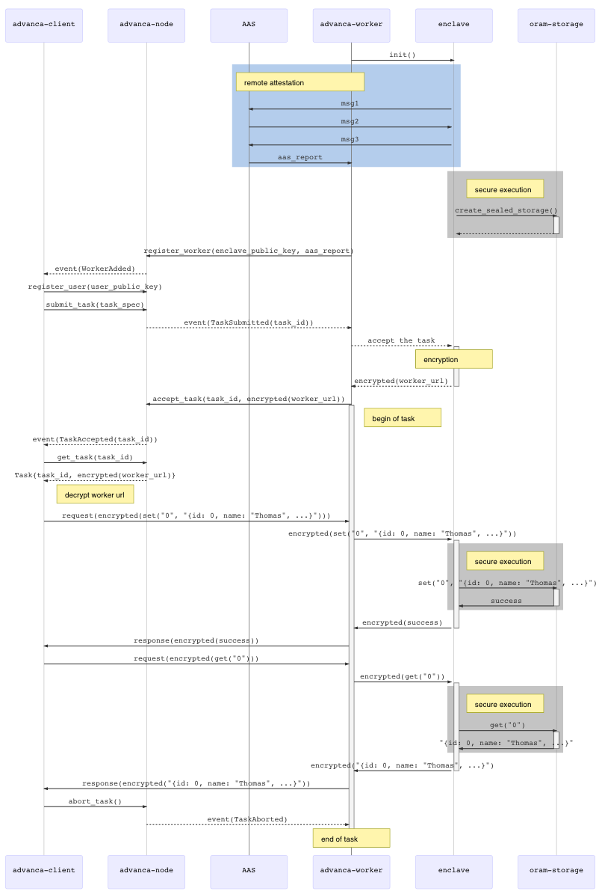

# Documentation

## Architecture

In the current design, Advanca has two different planes, control plane and compute/storage plane.

The control plane is the coordinator to outsource tasks and distribute rewards to compute/storage plane, as well as manages the registration in control and compute/storage plane with stakes and evaluates the performance of these nodes.

The compute/storage plane is for compute/storage nodes to accept and accomplish computational/storage tasks assigned by the control plane. Any machine that meets the requirements like a high volume disk and a trusted hardware such as Intel SGX or Arm TrustZone, can join Advanca to become a compute/storage worker.

### Advanca Node

[Advanca node](https://github.com/advanca/advanca-node) is the implementation of the control plane. In Advanca, all the nodes in the control plane will work together to maintain the consensus of the managed states, including worker and user registration, task managements, reward distribution, resource accounting, staking and reputation.

#### API

Nodes provide APIs for the public to join the network and for the registered entities to interact with the control plane. 

You can find the rust docs for the core module `advanca-core` [here](https://advanca.github.io/advanca-node/advanca_core/).

### Advanca Worker

[Advanca Worker](https://github.com/advanca/advanca-worker) is the implementation of the compute/storage plane where a trusted enclave is created for private task execution. The worker also provides APIs for the user to directly interact with the outsourced tasks. It also has privacy-preserving storage capability, designed to conceal the data access pattern.

#### API

Workers provide a set of APIs accessible to authenticated users, who are the owners of the outsourced tasks. The API is implemented with gRPC and protobuf, making it easy to use in a broad range of [languages](https://grpc.io/docs/tutorials/).

Currently, the definition of storage API can be found at [advanca-worker/protos/storage.proto](https://github.com/advanca/advanca-worker/blob/master/protos/storage.proto).

#### ORAM

[Obilivous RAM](https://en.wikipedia.org/wiki/Oblivious_RAM) (ORAM) is a mechanism to conceal the data access patterns that may reveal the actual intent of applications even data is encrypted. It is used in the worker to offer privacy-preserving storage capability, in addition to any encryption schemed used by the storage.

We create a rust implemention (<https://github.com/advanca/oram>) that provides easy-to-use, key-value storage for applications running inside the enclave. It uses [Intel SGX Protected File System](https://software.intel.com/en-us/articles/overview-of-intel-protected-file-system-library-using-software-guard-extensions) as the storage backend for encrypted storage, and [Square-Root ORAM](https://oblivc.org/docs/sqoram.pdf) for hiding the access pattern.

### Advanca Attestation Service

Advanca Attestation Service is a remote attestation service provided for any worker who wants to join the compute or storage plane in Advanca. Read more about it in the [attestation documentation](./attestation.md) or check the [source code repository](https://github.com/advanca/advanca-attestation-service).

Currently, we are hosting AAS for the workers. It's also possible for others who have subscribed to Intel Attestation Service to host similar services using the open-sourced implementation. However, as the project is under active development, the attestation protocol is subject to changes.

## Deployment Example

### Single Node and Single Worker

Here's the single-node, single-worker demo included in [Advanca v0.3](https://github.com/advanca/advanca/releases/tag/v0.3.0). The figure below presents the interaction sequences between programs and modules in the form of RPC calls, function calls, enclave trusted calls and events subscription, etc.

> Note: The diagram is simplified and may not reflect the latest implementation in the code.

<i>Figure: Single-Node Single-Worker Workflow</i>

The main parties are:

* **advanca-client**: the user who request encrypted storage resource
* **advanca-node**: the consensus node providing control-plane core functions and states storage
* **advanca-worker**: the resource provider with trusted hardware, where two componensts are selectively shown in the worflow:
  * **enclave**: the trusted execution environment processing the encrypted request
  * **oram-storage**: the oram storage stored outside of the enclave
* **advanca-attestation-service**: the deputy attestaion service provider from Advanca

Now let's look at the workflow from different aspects.

#### Registration

At the beginning, the `advanca-node` manages no user and workers, nor any tasks. Users and workers need to make the registration with the signle-node chain and lock some fund as the deposit. This is done by submitting a signed extrisinic using the registration functions.

The worker registration involves some preparation beforehand, and this is where it differs from user registration. As a worker with trusted hardware, remote attestation (See more in our [attestation documentation](./attestation.md)) will be done first with Advanca Attestation Service. As a result, the attestation report will be made public for anyone to verify its claim, i.e. a trusted environment. In Advanca, this report is stored on chain as part of the registration.

#### Task Management

The tasks are compute and storage resource request created by users. `advanca-node` manages task metadata and lifecycle information on chain to maintain the transparency. Users submit tasks to the chain, and workers accept the task and start the task execution. Users and workers, like customers and providers, will start the engagement first through the chain, before they talk to the other side for the task details.

Not all task information stored on chain are publicly viewable. For example, the worker's service endpoint `worker_url` is stored as ciphertext encrpyted by the derived secret (only known to the enclave and the user) when the worker's enclave accepts a task. It provides certain protection for the worker and more protections like this come in the future.

More details about task management are not covered here as the protocol is evolving rapidly. Keep an eye on the `advanca-core` module in our `advanca-code` repository.

#### Task Execution

The execution of the task begins when the worker accepts the task submitted previously by the user. In this particular example, the worker provides secure storage service, which allows direct user interaction in an end-to-end secure manner. To ensure confidentiality and integrity of the messages between worker and user, a shared secret is derived between both parties which is used to derive symmetric keys used to encrypt the request by the user and the response by the enclave. This also provides perfect forward secrecy for the messages.

Outside the enclave, the oram storage provides persistence, encryption and privacy. As per the threat model of the trusted execution technique, the storage is outside the security perimeter. Therefore, either a remote storage or local storage backed by disk is required. The oram storage offers privacy-preserving local storage capacity in the form of key-value pairs. The passive observer running in the same OS can neither see the content of the data (because of encryption), nor understand the real access pattern (because of ORAM).
