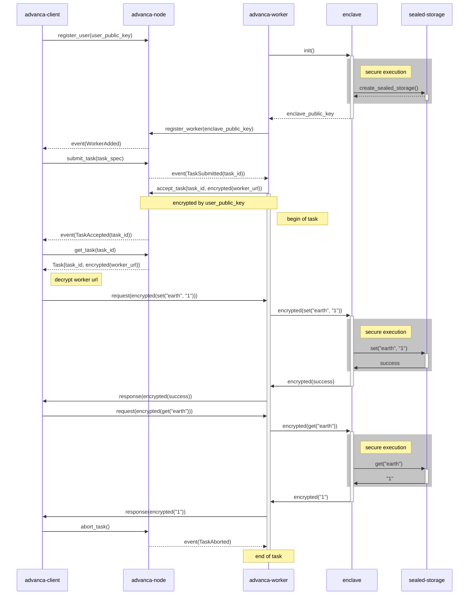

```mermaid
sequenceDiagram
  participant user as advanca-client
  participant node as advanca-node
  participant worker as advanca-worker
  participant enclave as enclave
  participant storage as sealed-storage

  user->>node: register_user(user_public_key)
  worker->>+enclave: init()
  rect rgb(196, 196, 196)
    Note right of enclave: secure execution
    enclave->>+storage: create_sealed_storage()
    storage-->>-enclave: 
  end
  enclave-->>-worker: enclave_public_key
  worker->>node: register_worker(enclave_public_key)
  node-->>user: event(WorkerAdded)
  
  user->>node: submit_task(task_spec)
  node-->>worker: event(TaskSubmitted(task_id))

  worker->>node: accept_task(task_id, encrypted(worker_url))
  activate worker
    Note over worker,node: encrypted by user_public_key
    Note right of worker: begin of task
    node-->>user: event(TaskAccepted(task_id))
    user->>node: get_task(task_id)
    node-->>user: Task{task_id, encrypted(worker_url)}
    Note right of user: decrypt worker url

    user->>worker: request(encrypted(set("earth", "1")))
    worker->>+enclave: encrypted(set("earth", "1"))
      rect rgb(196, 196, 196)
        Note right of enclave: secure execution
        enclave->>+storage: set("earth", "1")
        storage->>-enclave: success
      end
    enclave->>-worker: encrypted(success)
    worker->>user: response(encrypted(success))

    user->>worker: request(encrypted(get("earth")))
    worker->>+enclave: encrypted(get("earth"))
      rect rgb(196, 196, 196)
        Note right of enclave: secure execution
        enclave->>+storage: get("earth")
        storage->>-enclave: "1"
      end
    enclave->>-worker: encrypted("1")
    worker->>user: response(encrypted("1"))
  
    user->>node: abort_task()
    node-->>worker: event(TaskAborted)
    Note over worker: end of task
  deactivate worker

```