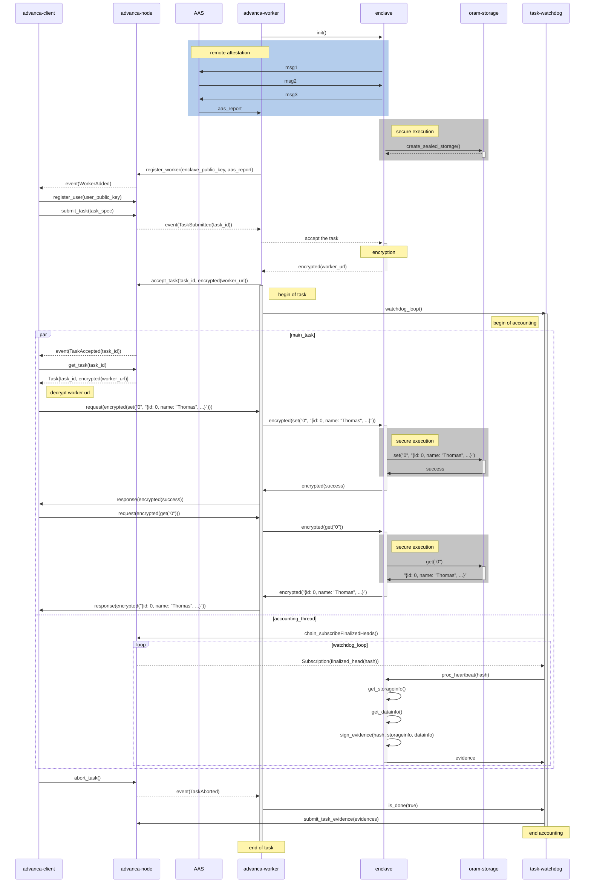

```mermaid
sequenceDiagram
  participant user as advanca-client
  participant node as advanca-node
  participant aas as AAS
  participant worker as advanca-worker
  participant enclave as enclave
  participant storage as oram-storage
  participant watchdog as task-watchdog

  worker->>+enclave: init()
  rect rgb(180, 205, 236)
    Note over aas,worker: remote attestation
    enclave->>aas: msg1
    aas->>enclave: msg2
    enclave->>aas: msg3
    aas->>worker: aas_report
  end
  rect rgb(196, 196, 196)
    Note right of enclave: secure execution
    enclave->>+storage: create_sealed_storage()
    storage-->>-enclave: 
  end
  worker->>node: register_worker(enclave_public_key, aas_report)
  node-->>user: event(WorkerAdded)
  
  user->>node: register_user(user_public_key)
  user->>node: submit_task(task_spec)
  node-->>worker: event(TaskSubmitted(task_id))
  worker-->>+enclave: accept the task
  Note over enclave: encryption
  enclave-->>-worker: encrypted(worker_url)
  worker->>node: accept_task(task_id, encrypted(worker_url))
  activate worker
    Note right of worker: begin of task
    worker->>watchdog: watchdog_loop()
    activate watchdog
    Note left of watchdog: begin of accounting
    
    par main_task
    node-->>user: event(TaskAccepted(task_id))
    user->>node: get_task(task_id)
    node-->>user: Task{task_id, encrypted(worker_url)}
    Note right of user: decrypt worker url

    user->>worker: request(encrypted(set("0", "{id: 0, name: "Thomas", ...}")))
    worker->>+enclave: encrypted(set("0", "{id: 0, name: "Thomas", ...}"))
      rect rgb(196, 196, 196)
        Note right of enclave: secure execution
        enclave->>+storage: set("0", "{id: 0, name: "Thomas", ...}")
        storage->>-enclave: success
      end
    enclave->>-worker: encrypted(success)
    worker->>user: response(encrypted(success))

    user->>worker: request(encrypted(get("0")))
    worker->>+enclave: encrypted(get("0"))
      rect rgb(196, 196, 196)
        Note right of enclave: secure execution
        enclave->>+storage: get("0")
        storage->>-enclave: "{id: 0, name: "Thomas", ...}"
      end
    enclave->>-worker: encrypted("{id: 0, name: "Thomas", ...}")
    worker->>user: response(encrypted("{id: 0, name: "Thomas", ...}"))
    and accounting_thread
    watchdog->>node: chain_subscribeFinalizedHeads()
    loop watchdog_loop
      node-->>watchdog: Subscription(finalized_head(hash))
      watchdog->>+enclave: proc_heartbeat(hash)
      enclave->>enclave: get_storageinfo()
      enclave->>enclave: get_datainfo()
      enclave->>enclave: sign_evidence(hash, storageinfo, datainfo)
      enclave->>-watchdog: evidence
    end
    end
    user->>node: abort_task()
    node-->>worker: event(TaskAborted)
    worker->>watchdog: is_done(true)
    watchdog->>node: submit_task_evidence(evidences)
    Note over watchdog: end accounting
    deactivate watchdog
    Note over worker: end of task
  deactivate worker

```

